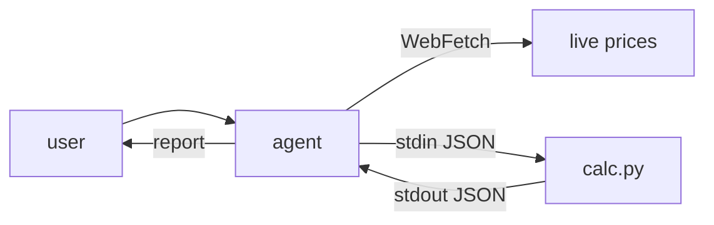

# api-vs-selfhost-skill

> Decide API-vs-self-host LLM economics and fine-tuning ROI from inside Claude Code, Cursor, Codex, or any agent harness with a shell + a web-fetch tool.

[](https://github.com/artvandelay/api-vs-selfhost-skill/actions/workflows/test.yml)
[](LICENSE)
[](#requirements)
[](https://agentskills.io/)
[](https://github.com/artvandelay/api-vs-selfhost-skill/stargazers)

**Works with**
[](https://docs.claude.com/en/docs/claude-code/skills)
[](https://cursor.com/docs/skills)
[](https://developers.openai.com/codex/concepts/customization)
[](https://github.com/google-gemini/gemini-cli)
[](https://antigravity.dev/)

The agent reads your code, PRDs, or billing screenshots; fetches live GPU and API prices; runs deterministic VRAM and dollar math via `scripts/calc.py`; and writes a short markdown report with cited sources.

Not in an agent? **[Use the web calculator →](https://artvandelay.github.io/should-i-self-host-llm/)**

## Install

A skill is just a folder with a `SKILL.md`, placed where your agent looks for skills. Install = clone this repo into that folder. Requires **Python 3.10+** (standard library only — nothing to `pip install`).

Pick the directory for your agent and clone:

```bash
# Claude Code (global, all projects)
git clone https://github.com/artvandelay/api-vs-selfhost-skill \
  ~/.claude/skills/api-vs-selfhost-skill

# Cursor (global)
git clone https://github.com/artvandelay/api-vs-selfhost-skill \
  ~/.cursor/skills/api-vs-selfhost-skill

# Codex CLI (global)
git clone https://github.com/artvandelay/api-vs-selfhost-skill \
  ~/.agents/skills/api-vs-selfhost-skill
```

Where each agent looks for skills:

| Agent | Global (all projects) | Project-scoped (this repo only) |
|---|---|---|
| Claude Code | `~/.claude/skills/` | `.claude/skills/` |
| Cursor | `~/.cursor/skills/` | `.cursor/skills/` |
| Codex CLI | `~/.agents/skills/` *(older versions: `~/.codex/skills/`)* | `.agents/skills/` |

> **Codex note:** global `~/.agents/skills/` support is recent. If your agent doesn't pick the skill up, you're likely on an older Codex — clone into `~/.codex/skills/api-vs-selfhost-skill` instead, or use the project-scoped `.agents/skills/` path. ([docs](https://developers.openai.com/codex/skills/))

**Then restart your agent and confirm it loaded:**

- **Claude Code** — ask: *"what skills do you have?"* (it should list `api-vs-selfhost-skill`)
- **Cursor** — Settings → Rules & Skills
- **Codex CLI** — run `/skills`, or type `$` to see the skill picker

**Update later:** `cd` into the cloned folder and `git pull`.

Prefer a project-scoped install (so the skill travels with one repo and your teammates get it on clone)? Use the project path from the table above instead of the `~/` global path.

## Usage

```text
Our OpenAI bill is killing us. We're on GPT-5.4 for an internal support
copilot — ~350k queries/week (weekday business hours), ~1.5k tokens each.
Should we self-host?
```

The agent fetches live prices, runs the engine across a few scenarios, and returns something like:

| traffic   | open model | GPU              | $/hr  | fits | self $/wk | API $/wk  | savings | verdict        |
|-----------|------------|------------------|-------|------|-----------|-----------|---------|----------------|
| business  | 70B INT4   | H100 PCIe 80GB   | $2.89 | yes  | $144.50   | $3,937.50 | 96.3%   | selfhost_wins  |
| business  | 32B INT4   | L40S 48GB        | $0.86 | yes  | $43.00    | $3,937.50 | 98.9%   | selfhost_wins  |
| uniform   | 70B INT4   | H100 PCIe 80GB   | $2.89 | yes  | $485.52   | $3,937.50 | 87.7%   | selfhost_wins  |
| bursty    | 70B INT4   | H100 PCIe 80GB   | $2.89 | yes  | $57.80    | $3,937.50 | 98.5%   | selfhost_wins  |

> `self $/wk` is **GPU rental only**, assuming one replica saturates the load — the agent reports the caveats (ops cost, KV-cache headroom, quality gap, replica count at higher volume) alongside every verdict. See [Limitations](#limitations).

Full transcript — including the agent flagging operational cost and a quality check before recommending: [`examples/openai-bill-too-high.md`](examples/openai-bill-too-high.md).

## How it works



1. **Extract** — scan the user message, open files, and attachments for volume, model, traffic shape.
2. **Fetch** — live GPU prices (Runpod / Lambda / Modal), API prices (models.dev, with vendor-page fallback if it's down), quality Elo (lmarena.ai). If no source is reachable, the agent asks for numbers rather than guessing.
3. **Clarify** — ask if volume, model, or spend are missing.
4. **Calculate** — `python3 scripts/calc.py inference | finetune` with JSON on stdin.
5. **Report** — verdict, cost table, assumptions with sources, what would flip the answer.

The LLM is the flexible front end; `calc.py` is the deterministic substrate that keeps it from hallucinating prices or VRAM math. [Code as Agent Harness](https://arxiv.org/abs/2605.18747).

## Limitations

A fast, directional estimate — **not a quote**. The engine models only what it can compute deterministically and the skill instructs the agent to flag the rest. The dollar figures:

- **Are GPU rental only.** `selfhost_weekly_usd` excludes serving infra, autoscaling, monitoring, on-call, and engineering time — often the deciding cost for a small team.
- **Assume one replica.** Self-host cost assumes a single GPU saturates your volume. Above modest QPS you need more; pass `replicas` (or let the agent estimate it) or the savings read optimistic. The engine warns when volume is high and replicas is left at 1.
- **Size VRAM on weights only.** `vram_needed_gb` excludes the KV cache, which grows with context length × batch and can dominate long-context / high-concurrency serving. "Fits" means the weights fit — leave headroom.
- **Don't measure quality.** A cheaper open model may not match the API model on your task. The agent flags large Elo gaps; only your own eval set settles it.
- **Are point-in-time.** Only as accurate as the prices fetched at that moment (cited with source + timestamp).

Full math, constants, and calibration: [sister-repo assumptions](https://github.com/artvandelay/should-i-self-host-llm/blob/main/src/ft/ASSUMPTIONS.md).

## Engine

`scripts/calc.py` is stdlib-only Python. Two subcommands, JSON on stdin, JSON on stdout.

```bash
echo '{"params_b":70,"quant":"int4","queries_per_week":1000000,"api_cost_per_query_usd":0.002,"traffic_pattern":"business","gpu":{"name":"H100 SXM 80GB","vram_gb":80,"usd_per_hr":2.90}}' \
  | python3 scripts/calc.py inference
```

Exit codes: `0` success · `2` bad input (`{"error","field"}` JSON) · `1` internal error.

Run the tests:

```bash
python3 -m unittest discover tests
```

## Repo layout

```
SKILL.md                          agent instructions (workflow + rules)
scripts/calc.py                   deterministic engine (stdlib only)
references/GPU_SPECS.md           static GPU specs (VRAM, BF16 TFLOPS)
references/INPUTS.md              input contract for calc.py
references/ASSUMPTIONS.md         pointer to canonical assumptions
examples/openai-bill-too-high.md  full sample transcript
tests/test_calc.py                unit tests
```

## Requirements

- Python 3.10+ (stdlib only — no pip)
- An agent harness with shell execution + a web-fetch tool (Claude Code, Cursor, Codex CLI, Gemini CLI, Antigravity, etc.)

## Credits

This skill stands on:

- **[should-i-self-host-llm](https://github.com/artvandelay/should-i-self-host-llm)** — sister repo. Canonical math, calibration anchors, and the [web calculator](https://artvandelay.github.io/should-i-self-host-llm/). All formula changes land there first.
- **[models.dev](https://models.dev/)** — open catalog of LLM API pricing and capabilities. The skill fetches per-token prices from here.
- **[Chatbot Arena (lmarena.ai)](https://lmarena.ai/)** — Elo leaderboard for quality comparison between API and open-weight models.
- **GPU vendors** — [Runpod](https://www.runpod.io/pricing), [Lambda](https://lambdalabs.com/service/gpu-cloud), [Modal](https://modal.com/pricing) for live `$/hr` data.
- **["Code as Agent Harness"](https://arxiv.org/abs/2605.18747)** — the design pattern this skill instantiates: deterministic code as the verifiable substrate under a flexible LLM front end.

## Contributing

Issues and PRs welcome — new GPU vendors, formula calibration, prompt tweaks. Math changes go to the sister repo first.

## License

[MIT](LICENSE).

---

Built collaboratively with Claude (Anthropic), running in Cursor. The honest story of how this skill came together — including the stress-test bugs, the over-engineered first draft, and the simplification pass — is in [NOTES.md](NOTES.md).
