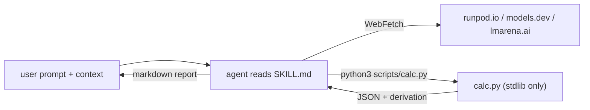

# api-vs-selfhost-skill

> Decide API-vs-self-host LLM economics and fine-tuning ROI from inside Claude Code, Cursor, Codex, or any agent harness with a shell + a web-fetch tool.

[](https://github.com/artvandelay/api-vs-selfhost-skill/actions/workflows/test.yml)
[](#requirements)
[](LICENSE)

The agent reads your code, PRDs, or billing screenshots; fetches live GPU and API prices; runs deterministic VRAM and dollar math via `scripts/calc.py`; and writes a short markdown report with cited sources.

> Prefer a web UI? Try the sister calculator: **[should-i-self-host-llm](https://artvandelay.github.io/should-i-self-host-llm/)** — same math, manual inputs, no install. This skill is for when you're already inside an agent.



## Install

| Agent | Skills directory |
|---|---|
| Claude Code | `~/.claude/skills/` |
| Cursor | `~/.cursor/skills/` |
| Codex CLI | `~/.agents/skills/` |
| Project-scoped (any of the above) | `.claude/skills/` · `.cursor/skills/` · `.agents/skills/` |

```bash
# pick the path that matches your agent
git clone https://github.com/artvandelay/api-vs-selfhost-skill \
  ~/.claude/skills/api-vs-selfhost-skill
```

Restart your agent. Verify with `/skills` (Codex), Settings → Rules (Cursor), or by asking the agent what skills it has (Claude Code). Update later with `git pull` inside the cloned directory.

## Usage

```text
Our OpenAI bill is killing us. We do ~1M queries/week at ~1.5k tokens each
on GPT-5.4. Should we self-host?
```

The agent will fetch live prices, run the engine, and return something like:

| traffic   | quality   | GPU              | $/hr  | fits | self $/wk | API $/wk  | savings | verdict        |
|-----------|-----------|------------------|-------|------|-----------|-----------|---------|----------------|
| business  | 70B INT4  | H100 PCIe 80GB   | $2.89 | yes  | $144.50   | $3,937.50 | 96.3%   | selfhost_wins  |
| business  | 32B INT4  | L40S 48GB        | $0.86 | yes  | $43.00    | $3,937.50 | 98.9%   | selfhost_wins  |
| uniform   | 70B INT4  | H100 PCIe 80GB   | $2.89 | yes  | $485.52   | $3,937.50 | 87.7%   | selfhost_wins  |
| bursty    | 70B INT4  | H100 PCIe 80GB   | $2.89 | yes  | $57.80    | $3,937.50 | 98.5%   | selfhost_wins  |

Full transcript: [`examples/openai-bill-too-high.md`](examples/openai-bill-too-high.md).

## How it works

1. **Extract** — scan the user message, open files, and attachments for volume, model, traffic shape.
2. **Fetch** — live GPU prices (Runpod / Lambda / Modal), API prices (models.dev), quality Elo (lmarena.ai).
3. **Clarify** — ask if volume, model, or spend are missing.
4. **Calculate** — `python3 scripts/calc.py inference | finetune` with JSON on stdin.
5. **Report** — verdict, cost table, assumptions with sources, what would flip the answer.

The LLM is the flexible front end; `calc.py` is the deterministic substrate that keeps it from hallucinating prices or VRAM math. [Code as Agent Harness](https://arxiv.org/abs/2605.18747).

## Engine

`scripts/calc.py` is stdlib-only Python. Two subcommands, JSON on stdin, JSON on stdout.

```bash
echo '{"params_b":70,"quant":"int4","queries_per_week":1000000,"api_cost_per_query_usd":0.002,"traffic_pattern":"business","gpu":{"name":"H100 80GB","vram_gb":80,"usd_per_hr":2.90,"bf16_tflops":989}}' \
  | python3 scripts/calc.py inference
```

Exit codes: `0` success · `2` bad input (`{"error","field"}` JSON) · `1` internal error.

Run the tests:

```bash
python3 -m unittest discover tests
```

## Repo layout

```
SKILL.md                          agent instructions (workflow + rules)
scripts/calc.py                   deterministic engine (stdlib only)
references/GPU_SPECS.md           static GPU specs (VRAM, BF16 TFLOPS)
references/INPUTS.md              input contract for calc.py
references/ASSUMPTIONS.md         pointer to canonical assumptions
examples/openai-bill-too-high.md  full sample transcript
tests/test_calc.py                unit tests
```

## Requirements

- Python 3.10+ (stdlib only — no pip)
- An agent harness with shell execution + a web-fetch tool (Claude Code, Cursor, Codex CLI, Gemini CLI, Antigravity, etc.)

## Related

- [should-i-self-host-llm](https://github.com/artvandelay/should-i-self-host-llm) — the canonical math + the [web calculator](https://artvandelay.github.io/should-i-self-host-llm/).

## Contributing

Issues and PRs welcome — new GPU vendors, formula calibration, prompt tweaks. Math changes go to the sister repo first.

## License

[MIT](LICENSE).
